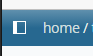

[](https://github.com/commongeek/datasette-sidebar/releases)
[](https://github.com/commongeek/datasette-sidebar/blob/main/LICENSE)

# datasette-sidebar
A simple plugin for Datasette that adds a sidebar with a list of tables and views.
An icon opening the sidebar is added in the lower left corner:


## Requirements

Requires Datesette version >= 1.0a16. It won't work with 0.65 and earlier. It may work with earlier versions of 1.0 but it has not been checked.

## Installation

The plugin is single-file and 100% JS, so no installation via PyPI packages is required. Just add a link to your Datasette configuration:

- if you use YAML format:
```yaml
extra_js_urls:
- https://cdn.jsdelivr.net/gh/commongeek/datasette-sidebar@latest/sidebar.min.js
```

- if you use JSON format:
```json
  "extra_js_urls": [
    "https://cdn.jsdelivr.net/gh/commongeek/datasette-sidebar@latest/sidebar.min.js"
  ]
```
If you want to host locally you need to copy the sidebar.js file to your static directory and modify the URL accordingly.

## Screenshot

